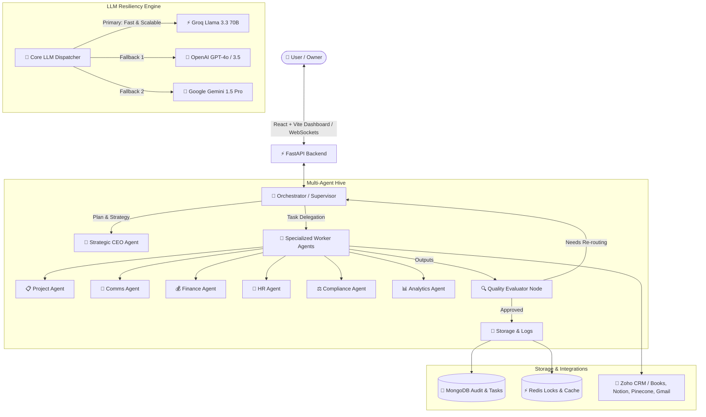

<div align="center">


  # ⚡ Condigence LLP — Autonomous Multi-Agent AI Operations
  ### Enterprise-Grade Agentic Workflow Orchestration & Human-in-the-Loop (HITL) Command Center

  <p align="center">
    
    
    
    
    
    
    
  </p>

  <p align="center">
    <b>A production-grade, hierarchical multi-agent ecosystem engineered to autonomously analyze, route, execute, validate, and govern complex enterprise workflows with zero single-point-of-failure LLM redundancy and human-in-the-loop governance.</b>
  </p>

  <p align="center">
    <a href="#-system-architecture">Architecture</a> •
    <a href="#-agent-ecosystem">Agent Hierarchy</a> •
    <a href="#-key-features--resilience">Key Features</a> •
    <a href="#-getting-started">Installation</a> •
    <a href="#-testing-guide">Testing Guide</a> •
    <a href="#-api-documentation">API Docs</a>
  </p>

</div>

<hr />

## 🌟 System Overview

**Condigence LLP Agentic System** provides an end-to-end intelligent operational backbone for enterprise operations. It couples dynamic LangGraph supervisor state routing with multi-tier worker specialists, automated quality evaluation loops, human-in-the-loop approvals, and a sleek real-time reactive WebSockets frontend dashboard.

---

## 🏗 System Architecture



---

## 🤖 Agent Ecosystem

<table>
  <thead>
    <tr>
      <th>Agent Role</th>
      <th>Key Capabilities & Scope</th>
      <th>Output Format</th>
    </tr>
  </thead>
  <tbody>
    <tr>
      <td><b>👑 CEO Agent</b></td>
      <td>Strategic high-level planning, resource allocation, cross-department synthesis, executive briefings.</td>
      <td>Structured Strategic Plan (JSON / Markdown)</td>
    </tr>
    <tr>
      <td><b>🧭 Supervisor / Orchestrator</b></td>
      <td>Dynamic state triage, intelligent agent selection, automated query decomposition, cyclical error re-routing.</td>
      <td>State transition & subtask dispatch</td>
    </tr>
    <tr>
      <td><b>📋 Project Agent</b></td>
      <td>Sprint planning, milestone tracking, resource management, deliverable timelines, Notion sync.</td>
      <td>Gantt / Milestone breakdown & Task list</td>
    </tr>
    <tr>
      <td><b>💬 Communications Agent</b></td>
      <td>Stakeholder messaging, email drafting (Gmail), client notifications (WhatsApp), outreach campaigns.</td>
      <td>Subject, Email Draft & Recipient mapping</td>
    </tr>
    <tr>
      <td><b>💰 Finance Agent</b></td>
      <td>Budget tracking, invoice audits, Zoho Books reconciliation, expense anomaly detection.</td>
      <td>Ledger items, Tax breakdown, Currency ledger</td>
    </tr>
    <tr>
      <td><b>👥 HR Agent</b></td>
      <td>Onboarding pathways, recruitment filters, KPI performance tracking, company policy enforcement.</td>
      <td>Personnel evaluations & Onboarding checklists</td>
    </tr>
    <tr>
      <td><b>⚖️ Compliance Agent</b></td>
      <td>Legal risk audits, GDPR/data safety checks, contractual compliance verification, SLA auditing.</td>
      <td>Risk score (0-100), Checklist & Mitigation actions</td>
    </tr>
    <tr>
      <td><b>📊 Analytics Agent</b></td>
      <td>KPI aggregation, trend forecasting, business performance modeling, executive reports.</td>
      <td>Statistical summaries & Actionable metrics</td>
    </tr>
    <tr>
      <td><b>🔍 Quality Evaluator</b></td>
      <td>Autonomous output validation, sanity checks, hallucination filtering, and completeness verification.</td>
      <td>Quality score, Approval flag & Review feedback</td>
    </tr>
  </tbody>
</table>

---

## 🛡️ Key Resilience & Enterprise Features

<details open>
<summary><b>1. Multi-Provider Fallback LLM Engine (Zero Downtime)</b></summary>
<p>
The system implements a tiered LLM calling strategy in <code>app/core/llm.py</code>. If the primary provider (Groq) experiences rate limits, timeouts, or downtime, the engine seamlessly cascades to OpenAI (GPT-4o), and subsequently to Google Gemini:
</p>

```
[Request] ➡️ Groq (Llama-3.3-70b) ──(On Failure)──> OpenAI (GPT-4o) ──(On Failure)──> Gemini Pro
```
</details>

<details open>
<summary><b>2. Robust JSON Sanitization & Parsing Engine</b></summary>
<p>
Integrated <code>app/core/json_util.py</code> utilizing <code>json_repair</code>, regex-based Markdown fence strippers, and multi-tier heuristics to ensure that LLM outputs with markdown wrappers (<code>```json ... ```</code>) or slight structural imperfections are cleanly decoded into valid Python dictionaries without runtime exceptions.
</p>
</details>

<details open>
<summary><b>3. Live WebSockets & Audit Trails</b></summary>
<p>
Every agent thought process, state transition, and tool invocation is broadcast via real-time WebSocket streams (<code>/ws/agent-stream</code>) to the frontend dashboard, and permanently archived with millisecond timestamps in MongoDB.
</p>
</details>

---

## 💻 Tech Stack

<div align="center">
  <table>
    <tr>
      <td align="center" width="25%"><b>Backend Framework</b></td>
      <td align="center" width="25%"><b>AI & Orchestration</b></td>
      <td align="center" width="25%"><b>Frontend UI</b></td>
      <td align="center" width="25%"><b>Databases & Caching</b></td>
    </tr>
    <tr>
      <td align="center">FastAPI<br/>Uvicorn<br/>Pydantic v2</td>
      <td align="center">LangGraph<br/>LangChain<br/>Groq / OpenAI / Gemini</td>
      <td align="center">React 18<br/>Vite<br/>Tailwind / Modern CSS</td>
      <td align="center">MongoDB (Motor async)<br/>Redis (aioredis)<br/>Kafka (aiokafka)</td>
    </tr>
  </table>
</div>

---

## 🚀 Getting Started

### 📋 Prerequisites
* **Python**: `3.10` or higher
* **Node.js**: `18.x` or higher (`npm` installed)
* **MongoDB**: MongoDB Atlas URI or local instance (`localhost:27017`)
* **Redis** *(Optional for local dev, recommended for prod locks)*

---

### 1️⃣ Backend Setup

```bash
# Clone the repository
git clone https://github.com/CondigenceProject/CondigenceLLP-Agents.git
cd CondigenceLLP-Agents

# Create and activate virtual environment
python -m venv .venv
# On Windows:
.venv\Scripts\activate
# On Linux/macOS:
source .venv/bin/activate

# Install dependencies
pip install -r requirements.txt
```

#### Configure Environment Variables
Copy `.env.example` to `.env` and configure your API keys:
```bash
cp .env.example .env
```
Fill in the credentials in `.env`:
```env
# LLM Providers
GROQ_API_KEY=your_groq_api_key
OPENAI_API_KEY=your_openai_api_key
GEMINI_API_KEY=your_gemini_api_key

# Databases
MONGO_URI=mongodb+srv://<username>:<password>@cluster.mongodb.net/condigence_db?retryWrites=true&w=majority
REDIS_URL=redis://localhost:6379/0

# Security & CORS
JWT_SECRET=your_jwt_secret_key
CORS_ORIGINS=http://localhost:5173,http://localhost:3000
```

#### Launch Backend Server
```bash
python main.py
```
> Backend API will be live at `http://localhost:8000`  
> Interactive OpenAPI documentation at `http://localhost:8000/docs`

---

### 2️⃣ Frontend Setup

```bash
# Navigate to frontend directory
cd frontend

# Install dependencies
npm install

# Start Vite development server
npm run dev
```
> Frontend Dashboard will be live at `http://localhost:5173`

---

## 🧪 Testing Guide

### 1. Automated Backend Test Suite
Run the test suite to verify MongoDB connectivity, LLM generation, JSON extraction, and agent execution:

```bash
# Run standalone test suite
python test_app.py
```

### 2. Manual API Endpoint Verification
You can test the agent execution API via `cURL` or Swagger UI (`http://localhost:8000/docs`):

```bash
curl -X POST "http://localhost:8000/api/v1/agents/execute" \
  -H "Content-Type: application/json" \
  -d '{
    "query": "Develop a comprehensive Q3 sprint roadmap for launching our new mobile client app.",
    "agent_type": "project"
  }'
```

### 3. Real-Time WebSockets Verification
Connect your WebSocket client (or view via the frontend dashboard) to:
```
ws://localhost:8000/ws/agent-stream
```

---

## 📂 Project Structure

```text
├── Condigence_System_Architecture_and_Operations_Manual.pdf  # Comprehensive 4-Page System Manual
├── Condigence_LLP_AI_System_SOW_and_Workplan.docx             # Statement of Work & Workplan
├── app/
│   ├── agents/
│   │   ├── ceo/              # Strategic CEO agent
│   │   ├── supervisor/       # Orchestrator & Quality Evaluator nodes
│   │   ├── workers/          # Project, Comms, Finance, HR, Compliance, Analytics agents
│   │   └── state.py          # Central LangGraph AgentState schema
│   ├── api/
│   │   ├── v1/               # REST endpoints (agents, approvals, audit, auth, webhooks)
│   │   └── websockets/       # Real-time WebSocket event streaming (/ws/agent-stream)
│   ├── core/
│   │   ├── llm.py            # Multi-provider fallback engine (Groq -> OpenAI -> Gemini)
│   │   ├── json_util.py      # Resilient JSON repair and parsing utility
│   │   ├── db.py             # Asynchronous MongoDB client
│   │   ├── redis_client.py   # Redis client & distributed locks
│   │   ├── kafka_client.py   # Event bus streaming
│   │   └── security.py       # JWT & cryptographic security
│   ├── integrations/         # Zoho CRM/Books, Notion, Pinecone, Gmail, WhatsApp
│   ├── models/               # Pydantic & Mongo schemas (tasks, approvals, audit logs)
│   ├── config.py             # Environment settings & configuration loader
│   └── server.py             # FastAPI application assembly & CORS middleware
├── frontend/
│   ├── src/
│   │   ├── App.jsx           # Command Center Dashboard & HITL approval UI
│   │   ├── main.jsx          # React DOM entry point
│   │   └── index.css         # Modern glassmorphism design tokens & styles
│   ├── package.json          # Frontend dependencies
│   └── vite.config.js        # Vite bundler configuration
├── main.py                   # Root application entry point
├── requirements.txt          # Python dependencies
├── test_app.py               # Integration & unit test runner
└── .env.example              # Sanitized environment configuration template
```

---

## 🔒 Security & Governance

* **Zero Hardcoded Secrets**: All credentials managed strictly via environment variables.
* **Human-in-the-Loop (HITL)**: High-risk financial or operational decisions trigger approval gates before execution.
* **Auditability**: 100% of LLM queries, tool invocations, and agent state transitions are permanently stored in MongoDB audit collections.

---

## 📄 Documentation

For full technical specifications, architecture diagrams, and operational procedures, refer to:
* 📄 [`Condigence_System_Architecture_and_Operations_Manual.pdf`](./Condigence_System_Architecture_and_Operations_Manual.pdf)

---

<div align="center">
  <sub>Built with ❤️ for <b>Condigence LLP</b>. All rights reserved.</sub>
</div>
